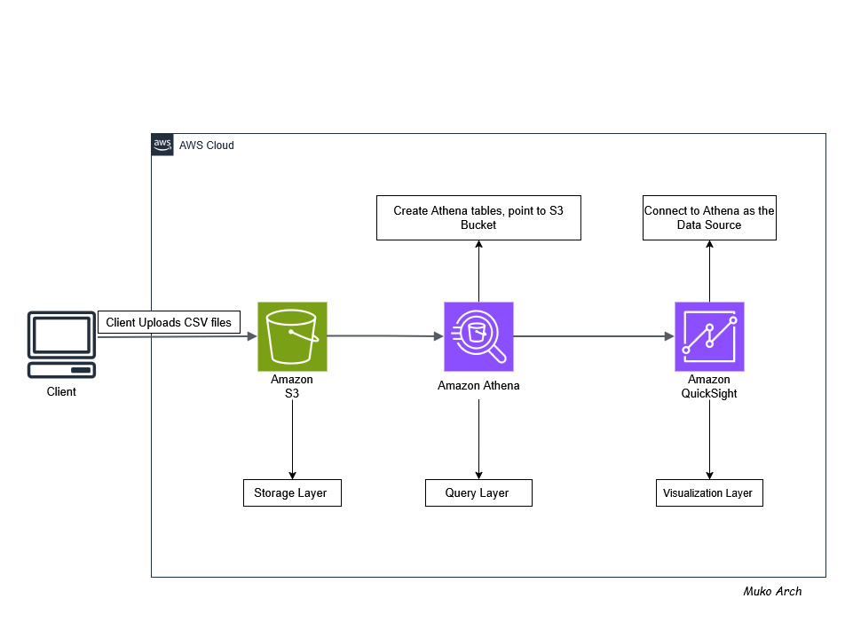
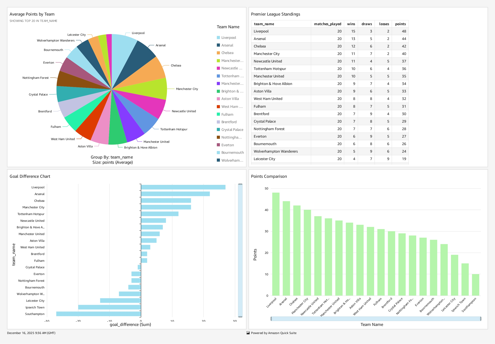

# Premier League 2025/26 Data Analytics Project

*Inspired by AWS Cookbook by John Culkin & Mike Zazon - Chapter 7: Big Data (Querying Files on S3 using Amazon Athena)*

Complete analytics pipeline for Premier League data using AWS S3, Athena, and QuickSight for interactive dashboards.

*I originally implemented this project directly through the AWS console, but this README demonstrates how to achieve the same results programmatically with automation.*

## Project Overview

This project demonstrates a full data analytics workflow:
- **Data Storage**: AWS S3 for raw CSV files
- **Data Processing**: AWS Athena for SQL queries
- **Data Visualization**: Amazon QuickSight for interactive dashboards

*Note: This project uses dummy Premier League data for demonstration purposes.*

## Technology Stack


**Core Technologies:**
- **AWS S3**: Object storage for raw CSV data files
- **Amazon Athena**: Serverless query service for data analysis
- **Amazon QuickSight**: Business intelligence and visualization
- **Python**: Automation scripts for setup and data processing
- **SQL**: Data querying and table creation
- **YAML**: Configuration management
- **Bash**: Command-line automation and deployment

## AWS Architecture Flow


## Project Structure

```
├── config/
│   └── config.yaml        # AWS configuration settings
├── data/                  # CSV data files
│   ├── match_results.csv  # Match results data
│   └── standings.csv      # Team standings data
├── scripts/               # Python automation scripts
│   ├── setup_athena.py    # Athena table creation script
│   └── upload_to_s3.py    # S3 upload automation
├── sql/                   # Athena table definitions and queries
│   ├── create_tables.sql  # Table creation DDL
│   └── sample_queries.sql # Sample analysis queries
├── .gitignore            # Git ignore file
├── AWS-Analytics.jpg     # Architecture diagram
├── Premier-League-Dummy-Dash.jpg  # Dashboard screenshot
├── README.md             # Project documentation
└── requirements.txt      # Python dependencies
```

## Setup Instructions

### 1. Prerequisites
- AWS Account with appropriate permissions
- AWS CLI configured
- Python 3.10+

### 2. Create S3 Bucket
```bash
# Generate unique bucket name
RANDOM_STRING=$(openssl rand -hex 3)
aws s3api create-bucket --bucket awscookbook704-$RANDOM_STRING
```

### 3. Upload Data to S3
```bash
# Navigate to project directory
cd /mnt/c/Users/HomePC/AWS-Analytics

# Upload CSV files
aws s3 cp data/standings.csv s3://awscookbook704-$RANDOM_STRING/raw-data/
aws s3 cp data/match_results.csv s3://awscookbook704-$RANDOM_STRING/raw-data/
```

### 4. Create Athena Tables

In AWS Athena Query Editor, run:

```sql
-- Create standings table
CREATE EXTERNAL TABLE IF NOT EXISTS standings (
    team_name STRING,
    matches_played INT,
    wins INT,
    draws INT,
    losses INT,
    goals_for INT,
    goals_against INT,
    goal_difference INT,
    points INT
)
ROW FORMAT DELIMITED
FIELDS TERMINATED BY ','
STORED AS TEXTFILE
LOCATION 's3://awscookbook704-YOUR_BUCKET_NAME/raw-data/'
TBLPROPERTIES ('skip.header.line.count'='1');

-- Create match results table
CREATE EXTERNAL TABLE IF NOT EXISTS match_results (
    team_name STRING,
    result_type STRING
)
ROW FORMAT DELIMITED
FIELDS TERMINATED BY ','
STORED AS TEXTFILE
LOCATION 's3://awscookbook704-YOUR_BUCKET_NAME/raw-data/'
TBLPROPERTIES ('skip.header.line.count'='1');
```

### 5. Verify Data
```sql
-- Test queries
SELECT * FROM standings LIMIT 10;
SELECT COUNT(*) FROM match_results;
```

## QuickSight Dashboard Setup

### 1. Initial Setup
1. Go to AWS QuickSight console
2. Sign up for QuickSight Standard edition
3. Grant permissions:
   - Athena access
   - S3 access to your bucket

### 2. Create Dataset
1. QuickSight → Datasets → New dataset
2. Choose "Athena" as data source
3. Data source name: "Premier League Analytics"
4. Select database and tables: `standings` and `match_results`
5. Import to SPICE for faster performance

### 3. Build Visualizations

**Dashboard includes:**

#### A. Premier League Standings (Table Visual)
- **Columns**: Position, Team, Played, Won, Drawn, Lost, GF, GA, GD, Points
- **Sort**: Points (descending), then Goal Difference
- **Purpose**: Complete league table with rankings

#### B. Points Comparison (Vertical Bar Chart)
- **X-axis**: team_name
- **Y-axis**: points
- **Color**: Team colors or gradient
- **Purpose**: Visual comparison of total points earned

#### C. Goal Difference Chart (Horizontal Bar Chart)
- **Y-axis**: team_name
- **X-axis**: goal_difference
- **Data source**: standings table
- **Purpose**: Visual representation of each team's goal difference performance

#### D. Average Points by Team (Pie Chart)
- **Segments**: team_name
- **Values**: points
- **Data source**: standings table
- **Purpose**: Proportional view of points distribution across all teams

### 4. Dashboard Features
- **Interactive filtering** by team
- **Drill-down capabilities** from charts to detailed data
- **Mobile-responsive design**
- **Auto-refresh** for updated data

## Sample Analysis Queries

```sql
-- Top 6 teams
SELECT team_name, points, goal_difference 
FROM standings 
ORDER BY points DESC 
LIMIT 6;

-- Teams with positive goal difference
SELECT team_name, goal_difference, points
FROM standings 
WHERE goal_difference > 0
ORDER BY goal_difference DESC;

-- Win percentage by team
SELECT team_name, 
       ROUND((wins * 100.0 / matches_played), 2) as win_percentage
FROM standings
ORDER BY win_percentage DESC;
```

## Data Schema

### standings table
- `team_name`: Team name (STRING)
- `matches_played`: Games played (INT)
- `wins`: Wins (INT)
- `draws`: Draws (INT)
- `losses`: Losses (INT)
- `goals_for`: Goals scored (INT)
- `goals_against`: Goals conceded (INT)
- `goal_difference`: Goal difference (INT)
- `points`: Total points (INT)

### match_results table
- `team_name`: Team name (STRING)
- `result_type`: Win/Draw/Loss (STRING)

## Cost Optimization

- **Athena**: $5 per TB scanned
- **S3**: ~$0.023 per GB/month
- **QuickSight**: $9/month per user (Standard)
- **Optimization tips**:
  - Use SPICE for frequently accessed data
  - Partition large datasets by date
  - Use Parquet format for better compression
  - Set up S3 lifecycle policies

## Dashboard Visualizations

📊 **Project Visualizations**
- **Dashboard Screenshot**: 


*To export your own dashboard:*
1. Open your QuickSight dashboard
2. Click "Export" → "Export to PDF" or take screenshots
3. Save visualizations to the project root folder

## Project Results

✅ **Completed Features:**
- S3 data storage with proper structure
- Athena tables for SQL analysis
- QuickSight interactive dashboard
- Multiple visualization types
- Sample Premier League 2025-26 data

📊 **Dashboard Insights:**
- Real-time league standings
- Performance comparisons
- Goal statistics analysis
- Win/loss distribution patterns

## Next Steps

1. **Add real-time data**: Connect to live Premier League APIs
2. **Enhanced analytics**: Player statistics, match predictions
3. **Advanced visualizations**: Heat maps, trend analysis
4. **Automated updates**: Schedule data refreshes
5. **Mobile app**: QuickSight mobile dashboard access

## License

[MIT License](LICENSE).

